# Используемое ПО

  - Delphi7
  - Allround Automations Direct Oracle Access (ver. 4.1)
  - DevExpress (ver. 14.1.3)
  - Oracle 11gXE (насколько я понял вы используете такую версию)
  - DataGrip [DataGrip](https://www.jetbrains.com/datagrip/) (для импорта данных из csv файлов - папка "Data")

# Запуск скриптов

Все скрипты находятся в папке "Scripts".

1. Подключаемя к серверу под пользователем "system" и запускаем скрипт "create_user.sql".
2. Подключаемя к серверу под новым пользователем "tst" (password: 123), и выполняем скрипт "create_user.sql". 
3. Выполняем скрипт "procedure.sql".

# Работа с программой

- При запуке проекта появляется окно авторизации. Соответственно вводим пользователь и пароль (tst,123).

- При запуске главного окна выбираем слева населенный пункт и справа в гриде получаем список улиц

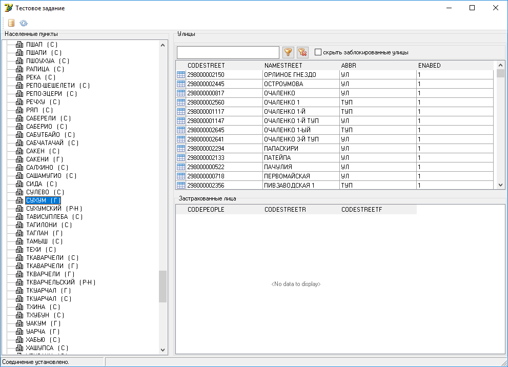

- При выборе конкретной улицы получаем список застрахованных лиц 

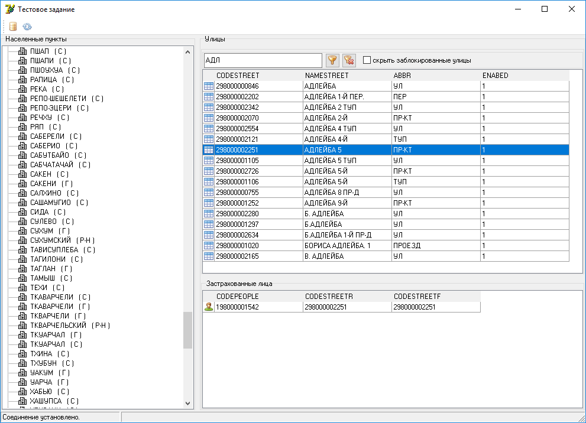

- Над списком улиц есть поле ввода для фильтрации списка улиц по любому вхождению введеной фразы в названии улицы (LIKE '%<введенная фраза>%'). При нажатии правой клавишей мышки по выделенной строке улицы появляется всплывающее меню "Объединить"

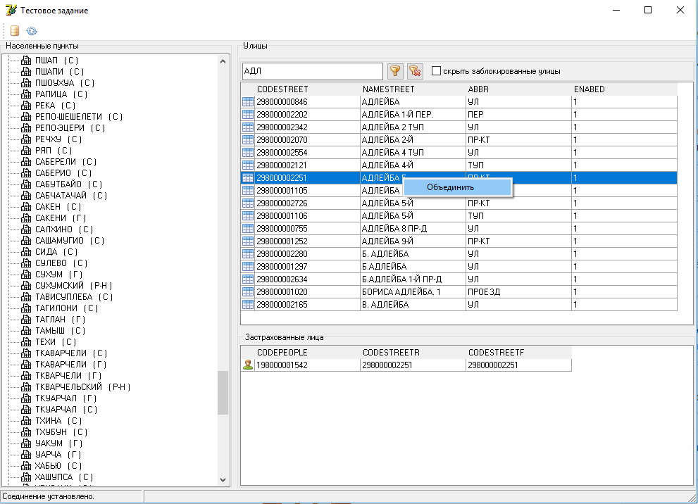
 
 - Подтверждаем процесс объединения выбранной улицы

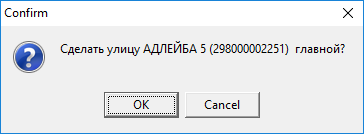

- После объединения улиц получаем заблокированные улицы

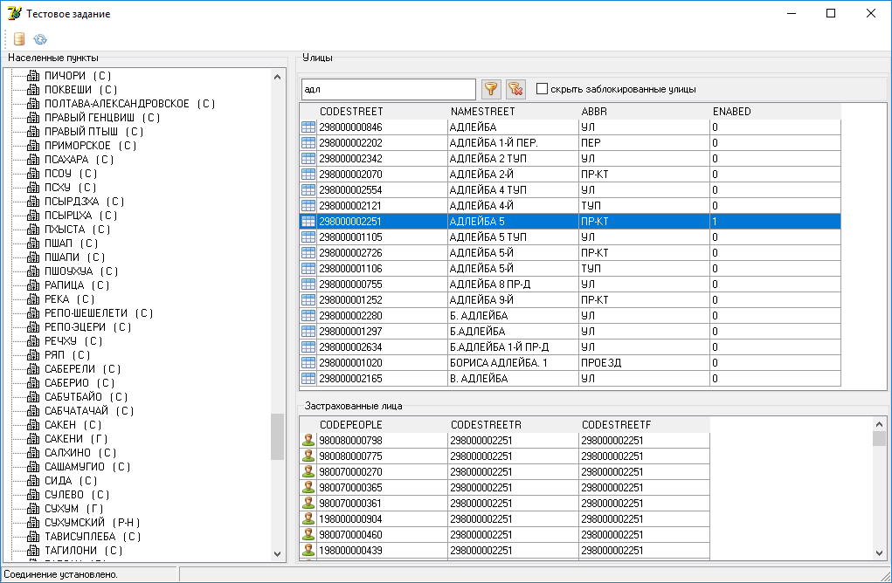

- Также можно воспользоваться опцией "скрыть заблокированные улицы"

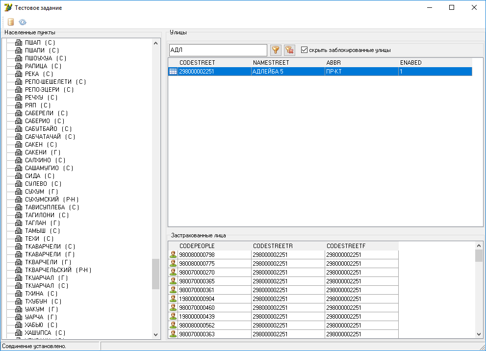

- При нажатии правой клавишей мышки в области грида застрахованных лиц появляется всплывающее меню "Просмотр истории перекодировок"

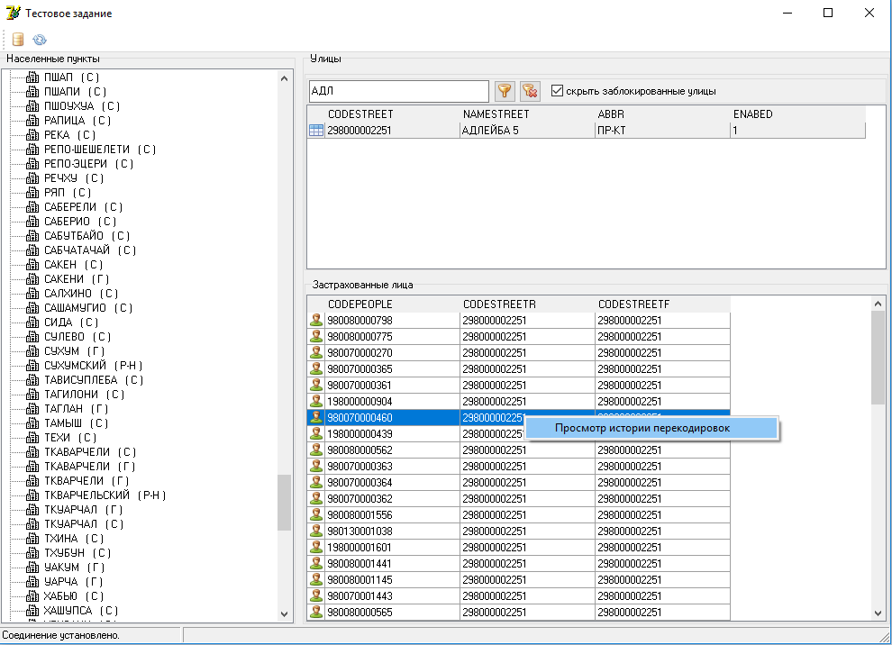

- Просмотр истории перекодировок улиц

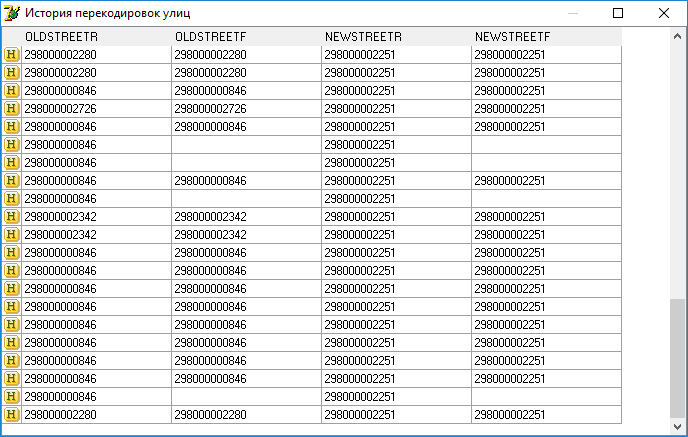

- При попытке объединить заблокированную улицу получаем сообщение об ошибке

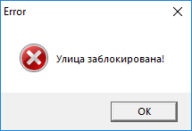

- При попытке объединить пустой список или одну улицу так же получаем сообщение об ошибке

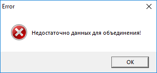

- При попытке соединения с сервером через главное окно программы при уже имеющимя соединении получаем сообщение об ошибке
 
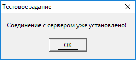

# Подход к реализации пунктов 3.1-3.3 задачи

Для реализации данных пунктов был принят следующий вариант:

1. Использование временной таблицы для получения кодов улиц для объединения (блокирование улиц и обновление адресов застрахованных лиц)
2. Тригер на update таблицы PEOPLESTREET для записи истории перекодировок в таблицу DECODESTREET

В процессе решения пунктов 3.1-3.3 задания рассматривались варианты использования курсоров или коллекций, но их реализации подразумевает пошаговый проход по элементам, что недопустимо в том случае если у застрахованного лица адрес регистрации и фактический попадают в список улиц для объединения. В таком случае по одну застрахованному лицу будут две строки в таблице перекодировок, что противоречит условиям задачи.

