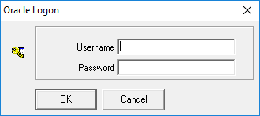

# Используемое ПО

  - Delphi7
  - Allround Automations Direct Oracle Access (ver. 4.1)
  - DevExpress (ver. 14.1.3)
  - Oracle 11gXE (насколько я понял вы используете такую версию)
  - DataGrip [DataGrip](https://www.jetbrains.com/datagrip/) (для импорта данных из csv файлов - папка "Data")

# Запуск скриптов

Все скрипты находятся в папке "Scripts".

1. Подключаемя к серверу под пользователем "system" и запускаем скрипт "create_user.sql".
2. Подключаемя к серверу под новым пользователем "tst" (password: 123), и выполняем скрипт "create_user.sql". 
3. Выполняем скрипт "procedure.sql".

# Работа с программой

При запуке проекта появляется окно авторизации. Соответственно вводим пользователь и пароль (tst,123). рис 1.
